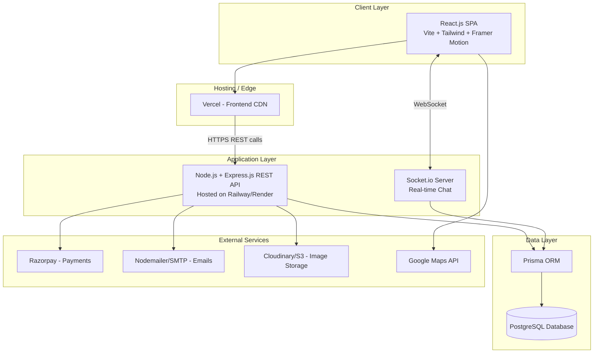
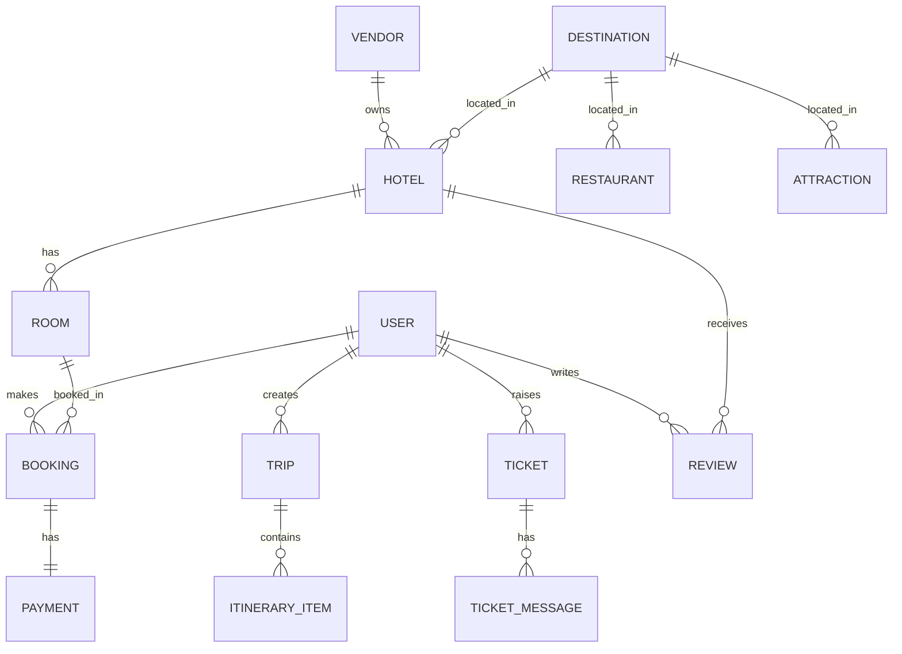
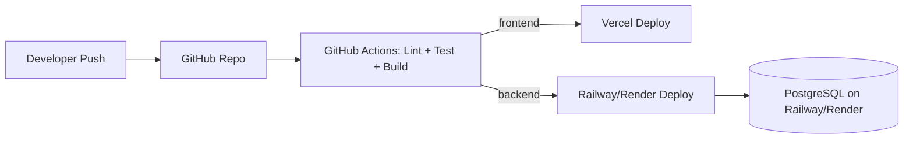

# Technical Architecture Document
## Travel & Tourism Web Platform

---

## 1. High-Level Architecture



---

## 2. Architectural Style

- **Pattern:** Layered (N-tier) architecture with a clear separation of Frontend (SPA), Backend (REST API), and Database.
- **API Style:** RESTful JSON APIs, versioned (`/api/v1/...`).
- **Backend structure:** MVC + Service/Repository pattern for testability and separation of concerns.
- **Communication:** HTTPS for REST; WebSocket (Socket.io) for real-time chat/support.

---

## 3. Frontend Architecture (React.js)

```
src/
├── assets/                 # images, icons, fonts
├── components/             # reusable UI components (Button, Card, Modal, Navbar)
├── features/                # feature-based modules
│   ├── auth/
│   ├── destinations/
│   ├── hotels/
│   ├── booking/
│   ├── food/
│   ├── tourist-assistant/
│   └── support/
├── layouts/                 # page layouts (MainLayout, AdminLayout)
├── pages/                   # route-level pages
├── hooks/                   # custom hooks (useAuth, useDebounce, useFetch)
├── context/ or store/       # global state (Context API / Redux Toolkit / Zustand)
├── services/                 # Axios API service layer (one file per module)
├── animations/               # Framer Motion variants, AOS configs
├── utils/                    # helpers, validators, constants
├── routes/                   # React Router route definitions + protected routes
└── App.jsx / main.jsx
```

**Key choices:**
- **Routing:** React Router v6 (nested routes, protected routes via HOC/wrapper).
- **State management:** Redux Toolkit (or Zustand for simpler global state) + React Query/TanStack Query for server-state caching.
- **Styling:** Tailwind CSS for utility-first styling + design consistency.
- **Animation:** Framer Motion for page/component transitions; AOS or CSS `transition`/`transform` for scroll & hover effects.
- **API layer:** Centralized Axios instance with interceptors (attach JWT, handle 401 refresh/logout).
- **Forms:** React Hook Form + Zod/Yup validation.

---

## 4. Backend Architecture (Node.js + Express.js)

```
server/
├── src/
│   ├── config/               # db.js, env.js, razorpay.js, cloudinary.js
│   ├── controllers/          # request handlers (thin layer)
│   ├── services/             # business logic
│   ├── repositories/         # Prisma queries abstracted here
│   ├── routes/                # express routers per module (v1)
│   ├── middlewares/          # auth, error handler, rate limiter, validator
│   ├── validators/           # request schema validation (Zod/Joi)
│   ├── sockets/               # Socket.io event handlers (chat)
│   ├── jobs/                   # cron/background jobs (booking reminders, cleanup)
│   ├── utils/                  # logger, response formatter, helpers
│   └── app.js
├── prisma/
│   ├── schema.prisma
│   └── migrations/
└── server.js
```

**Request flow:**
`Route → Middleware (auth/validation) → Controller → Service → Repository (Prisma) → PostgreSQL`

**Core backend modules:**
- `auth` — register, login, refresh token, logout, password reset.
- `users` — profile CRUD.
- `destinations` — CRUD + search/filter.
- `hotels` — listing CRUD, availability, reviews.
- `bookings` — booking lifecycle + Razorpay order/payment verification.
- `food` — restaurant/cuisine listings per destination.
- `assistant` — FAQ data + chat session handling.
- `support` — ticket CRUD, chat handoff to agents.
- `admin` — analytics, moderation, user/vendor management.

---

## 5. Database Architecture (PostgreSQL + Prisma)

### 5.1 Core Entities (ERD Summary)



### 5.2 Key Prisma Models (illustrative)

- `User (id, name, email, passwordHash, role, createdAt...)`
- `Vendor (id, userId, businessName, verified...)`
- `Destination (id, name, country, state, description, images[], bestTimeToVisit...)`
- `Hotel (id, vendorId, destinationId, name, address, amenities[], rating...)`
- `Room (id, hotelId, type, price, capacity, totalRooms...)`
- `Booking (id, userId, roomId, checkIn, checkOut, guests, status, totalAmount...)`
- `Payment (id, bookingId, razorpayOrderId, razorpayPaymentId, status, amount...)`
- `Trip (id, userId, title, startDate, endDate, budget...)`
- `ItineraryItem (id, tripId, destinationId, day, activity, notes...)`
- `Restaurant (id, destinationId, name, cuisine[], priceRange, location...)`
- `Review (id, userId, hotelId?, destinationId?, rating, comment...)`
- `Ticket (id, userId, subject, status, priority, assignedAgentId...)`
- `TicketMessage (id, ticketId, senderId, message, attachments[]...)`

**Design principles:**
- Use PostgreSQL `enum` types for `role`, `bookingStatus`, `ticketStatus`.
- Foreign keys with `onDelete: Cascade` where child data is meaningless without parent (e.g., `ItineraryItem` → `Trip`).
- Indexes on frequently filtered columns: `destinationId`, `checkIn/checkOut`, `email` (unique).
- Use Prisma migrations for schema versioning (`prisma migrate dev` / `deploy`).

---

## 6. External Integrations

| Service | Purpose |
|---|---|
| **Razorpay** | Payment order creation, checkout, webhook-based payment verification |
| **Nodemailer + SMTP (or Resend/SendGrid)** | Booking confirmations, password reset, ticket notifications |
| **Cloudinary / AWS S3** | Hotel/destination image uploads and storage |
| **Google Maps JS/Embed API** | Destination & hotel location display |
| **Socket.io** | Real-time chat between user and support agent |

---

## 7. Deployment Architecture

- **Frontend:** React app built with Vite, deployed to **Vercel** (auto CDN, preview deployments per PR).
- **Backend:** Express API deployed to **Railway** or **Render** (Node runtime, auto-deploy from GitHub).
- **Database:** Managed **PostgreSQL** instance on Railway/Render.
- **CI/CD:** GitHub Actions — lint + test on PR → auto-deploy on merge to `main`.
- **Environment separation:** `.env.development`, `.env.staging`, `.env.production` (never committed; managed via platform's environment variable dashboard).



---

## 8. Scalability Considerations

- Stateless Express API → can be horizontally scaled behind Railway/Render's load balancing.
- Prisma connection pooling (or PgBouncer) to handle concurrent DB connections efficiently.
- Redis (optional, future) for caching destination/hotel search results and session/rate-limit data.
- Image assets served via CDN (Cloudinary) rather than backend server.
- Pagination + indexed queries for all list endpoints (hotels, destinations, bookings).

---

## 9. Animation & Interaction Layer (Technical Notes)

- **Framer Motion** for: route transitions, modal enter/exit, staggered list animations (destination/hotel cards).
- **CSS `transition` / `transform`** for lightweight hover states (card lift + shadow, button scale, image zoom-on-hover).
- **AOS (Animate on Scroll)** or Framer's `useInView` for scroll-triggered reveal animations on landing/destination pages.
- Keep animations under 300ms for perceived responsiveness; respect `prefers-reduced-motion` for accessibility.
