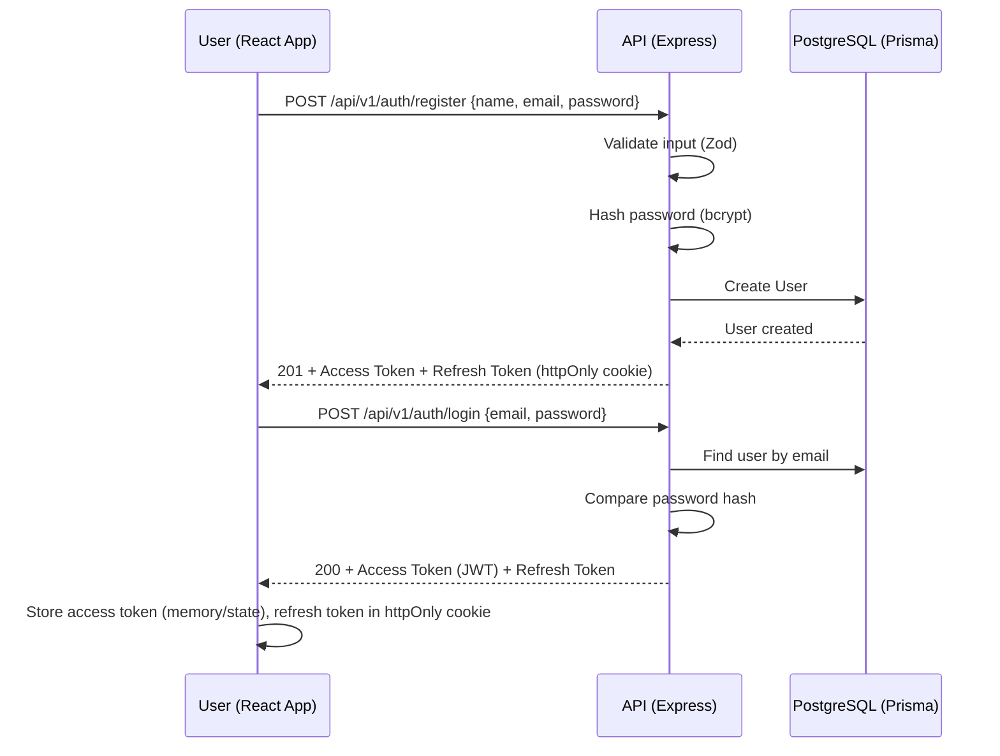
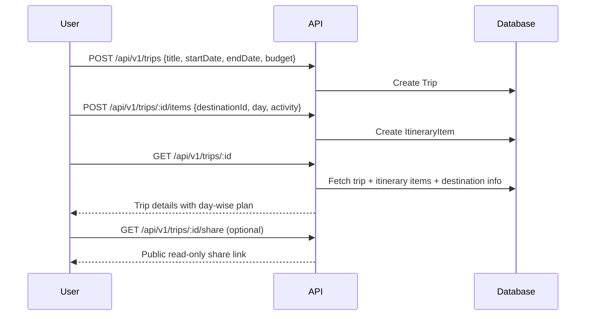
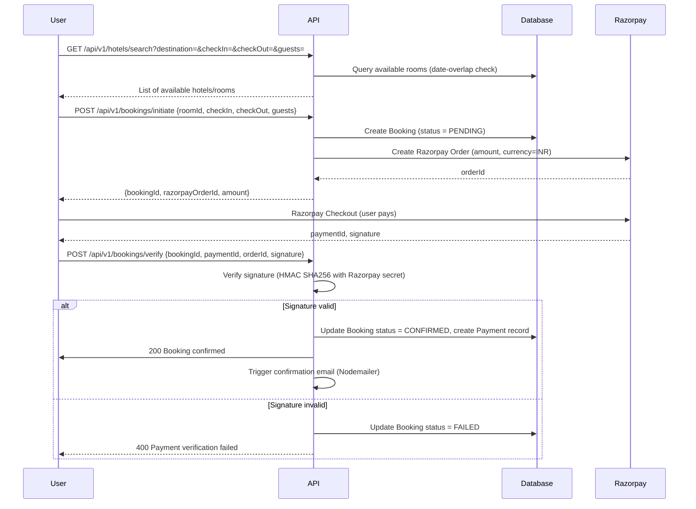
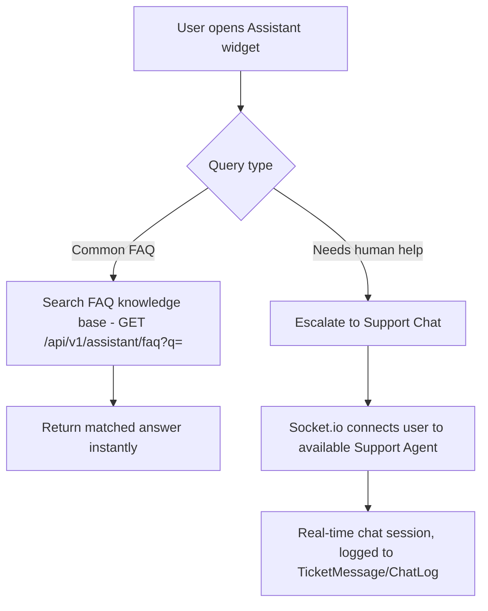
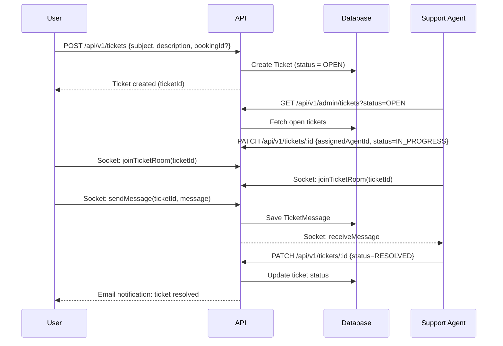
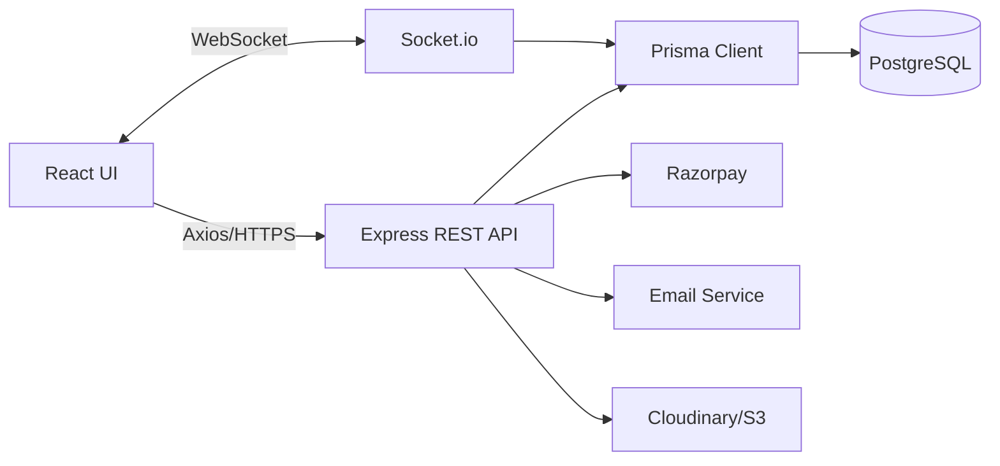

# System Workflow Document
## Travel & Tourism Web Platform

---

## 1. User Registration & Login Flow

---

## 2. Trip Planning Workflow

---

## 3. Destination Discovery Workflow

1. User lands on **Explore Destinations** page.
2. Frontend calls `GET /api/v1/destinations?category=&budget=&search=` with filters.
3. Backend queries PostgreSQL (indexed on category/state) via Prisma, returns paginated results.
4. User opens a destination → `GET /api/v1/destinations/:id` returns full detail (images, weather info, attractions, nearby hotels, nearby restaurants, reviews).
5. Reviews are fetched with pagination (`GET /api/v1/destinations/:id/reviews`).

---

## 4. Hotel Booking Workflow (Core Flow)

**Additional flows:**
- **Webhook fallback:** Razorpay webhook (`payment.captured`, `payment.failed`) hits `POST /api/v1/payments/webhook` as a source of truth in case the client-side verification call is missed (network drop). Webhook signature is also verified.
- **Cancellation:** `POST /api/v1/bookings/:id/cancel` → checks cancellation policy → updates status → (optional) triggers refund via Razorpay Refund API.

---

## 5. Food & Local Cuisine Workflow

1. On a destination page, frontend calls `GET /api/v1/destinations/:id/restaurants`.
2. Backend returns restaurant list (cuisine tags, price range, rating) filtered/sorted by rating or price.
3. User views restaurant detail (`GET /api/v1/restaurants/:id`) — menu highlights, location map pin.

---

## 6. Tourist Assistant Workflow

- FAQ content (visa info, emergency contacts, local transport, currency tips) is stored per-destination in the database and served via a simple search endpoint.
- If the FAQ doesn't resolve the query, the widget offers "Talk to Support," which opens a live chat session via Socket.io.

---

## 7. Customer Service / Support Ticket Workflow

---

## 8. Vendor (Hotel Partner) Workflow

1. Vendor registers/is invited → account marked `role = VENDOR`, `verified = false` until admin approval.
2. Vendor creates hotel listing (`POST /api/v1/vendor/hotels`) with images (uploaded to Cloudinary), amenities, rooms & pricing.
3. Admin reviews and approves listing (`PATCH /api/v1/admin/hotels/:id/approve`) before it becomes publicly visible.
4. Vendor views bookings on their dashboard (`GET /api/v1/vendor/bookings`), manages availability calendar.

---

## 9. Admin Workflow

- **Dashboard:** Aggregate stats — total bookings, revenue, active users, pending vendor approvals (`GET /api/v1/admin/analytics`).
- **Moderation:** Approve/reject hotel listings, remove inappropriate reviews.
- **Dispute handling:** View flagged bookings/tickets, issue refunds via Razorpay Refund API.
- **User management:** Suspend/activate users or vendors.

---

## 10. End-to-End Data Flow Summary

